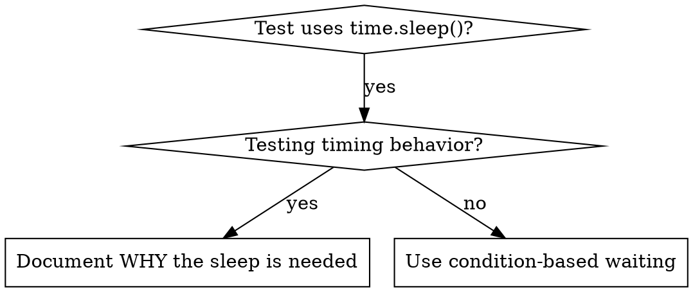

# Condition-Based Waiting

## Overview

Flaky tests often guess at timing with arbitrary delays. This creates race conditions where tests pass on fast machines but fail under load or in CI.

**Core principle:** Wait for the actual condition you care about, not a guess about how long it takes.

## When to Use



**Use when:**
- Tests have arbitrary delays (`time.sleep(...)`)
- Tests are flaky (pass sometimes, fail under load)
- Tests time out when run in parallel (e.g. `pytest -n auto`)
- Waiting for async / background work to complete

**Don't use when:**
- Testing actual timing behavior (debounce, throttle intervals)
- Always document WHY if using an arbitrary timeout

## Core Pattern

```python
# ❌ BEFORE: guessing at timing
time.sleep(0.05)
result = get_result()
assert result is not None

# ✅ AFTER: waiting for the condition
result = wait_for(lambda: get_result(), "result to be produced")
assert result is not None
```

## Quick Patterns

| Scenario | Pattern |
|----------|---------|
| Wait for event | `wait_for(lambda: next((e for e in events if e.type == "DONE"), None), "DONE event")` |
| Wait for state | `wait_for(lambda: machine.state == "ready", "machine ready")` |
| Wait for count | `wait_for(lambda: len(items) >= 5, "5 items")` |
| Wait for file | `wait_for(lambda: path.exists(), f"{path} to exist")` |
| Complex condition | `wait_for(lambda: obj.ready and obj.value > 10, "obj ready with value > 10")` |

## Implementation

Generic polling helper (put it in `tests/conftest.py` or a test util module):

```python
import time
from typing import Callable, TypeVar

T = TypeVar("T")


def wait_for(
    condition: Callable[[], T],
    description: str,
    timeout: float = 5.0,
    interval: float = 0.01,
) -> T:
    """Poll `condition` until it returns a truthy value, then return it.

    Raises TimeoutError with `description` if `timeout` seconds elapse first.
    """
    deadline = time.monotonic() + timeout
    while True:
        result = condition()
        if result:
            return result
        if time.monotonic() > deadline:
            raise TimeoutError(f"Timeout waiting for {description} after {timeout}s")
        time.sleep(interval)  # poll every 10ms by default
```

See `condition-based-waiting-example.py` in this directory for domain-specific helpers
(`wait_for_event`, `wait_for_event_count`, `wait_for_event_match`) built on top of `wait_for`.

## Common Mistakes

**❌ Polling too fast:** `interval=0.0001` — wastes CPU
**✅ Fix:** Poll every ~10ms (`interval=0.01`)

**❌ No timeout:** loop forever if the condition is never met
**✅ Fix:** always pass a timeout with a clear message

**❌ Stale data:** capturing state once before the loop
**✅ Fix:** call the getter *inside* the lambda so each poll re-reads fresh data

## When an Arbitrary Timeout IS Correct

```python
# A worker ticks every 100ms; we need 2 ticks to verify partial output.
wait_for(lambda: worker.started, "worker to start")  # First: wait for the condition
time.sleep(0.2)                                       # Then: wait for timed behavior
# 200ms = 2 ticks at 100ms — documented and justified
```

**Requirements:**
1. First wait for the triggering condition
2. Base the delay on known timing (not a guess)
3. Comment explaining WHY

## Real-World Impact

Replacing arbitrary `time.sleep()` calls with condition polling typically:
- Turns flaky suites green (pass rate 60% → 100%)
- Runs faster (no over-long fixed waits)
- Removes race conditions that only appear under CI load
