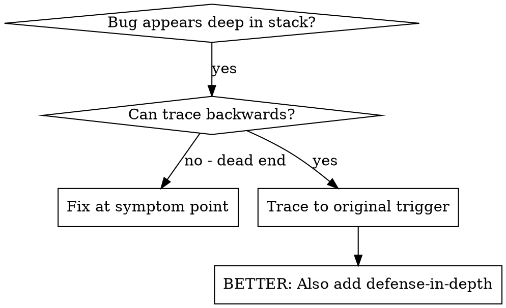
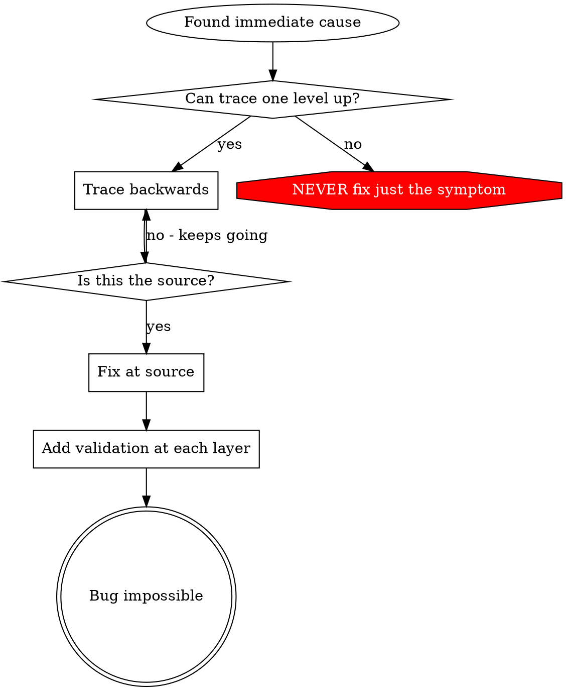

# Root Cause Tracing

## Overview

Bugs often manifest deep in the call stack (git init in the wrong directory, a file created in the wrong location, a database opened with the wrong path). Your instinct is to fix where the error appears, but that's treating a symptom.

**Core principle:** Trace backward through the call chain until you find the original trigger, then fix at the source.

## When to Use



**Use when:**
- Error happens deep in execution (not at the entry point)
- The stack trace shows a long call chain
- It's unclear where the invalid data originated
- You need to find which test/code triggers the problem

## The Tracing Process

### 1. Observe the Symptom
```
Error: git init failed in ~/project/src/core
```

### 2. Find the Immediate Cause
**What code directly causes this?**
```python
subprocess.run(["git", "init"], cwd=project_dir, check=True)
```

### 3. Ask: What Called This?
```
WorktreeManager.create_session_worktree(project_dir, session_id)
  ← called by Session.initialize_workspace()
  ← called by Session.create()
  ← called by the test via create_project()
```

### 4. Keep Tracing Up
**What value was passed?**
- `project_dir = ""` (empty string!)
- An empty string as `cwd` resolves to `os.getcwd()`
- That's the source tree!

### 5. Find the Original Trigger
**Where did the empty string come from?**
```python
context = setup_core_test()          # returns tempdir="" at import time
create_project("name", context.tempdir)  # accessed before the fixture ran!
```

## Adding Stack Traces

When you can't trace manually, add instrumentation:

```python
import os
import subprocess
import sys
import traceback


def git_init(directory: str) -> None:
    # Print before the problematic operation.
    print(
        f"DEBUG git init: directory={directory!r} cwd={os.getcwd()!r}\n"
        + "".join(traceback.format_stack()),
        file=sys.stderr,
    )
    subprocess.run(["git", "init"], cwd=directory, check=True)
```

**Critical:** print to `sys.stderr` (or use `caplog`); pytest captures stdout/stderr by default,
so run with `-s` to see it live.

**Run and capture:**
```bash
uv run pytest -s 2>&1 | grep 'DEBUG git init'
```

**Analyze the stack frames:**
- Look for test file names
- Find the line number triggering the call
- Identify the pattern (same test? same parameter?)

## Finding Which Test Causes Pollution

If something appears during the suite but you don't know which test creates it, use pytest's
native tooling rather than a bespoke script:

- **Isolate:** run a suspect test alone — `uv run pytest path/test_x.py::test_name` — and compare
  with the in-suite run.
- **Kill ordering effects:** `uv run pytest -p no:randomly` (or replay a seed with `pytest-randomly`)
  to see whether the failure is order-dependent.
- **Narrow down:** `uv run pytest --lf -x` reruns the last failures and stops at the first.
- **Bisect:** run halves of the suite (`pytest <subset>`) until the polluting test is isolated.

## Real Example: Empty project_dir

**Symptom:** `.git` created in `src/core/` (the source tree)

**Trace chain:**
1. `git init` runs in `os.getcwd()` ← empty `cwd` argument
2. `WorktreeManager` called with an empty `project_dir`
3. `Session.create()` passed an empty string
4. The test accessed `context.tempdir` before the fixture initialized it
5. `setup_core_test()` returns `tempdir=""` initially

**Root cause:** module-level variable initialization reading an empty value

**Fix:** make `tempdir` a property that raises if accessed before the fixture runs

**Also added defense-in-depth:**
- Layer 1: `create_project()` validates the directory
- Layer 2: `WorkspaceManager` validates it's not empty
- Layer 3: environment guard refuses `git init` outside `tempfile.gettempdir()` in tests
- Layer 4: stack-trace logging before `git init`

## Key Principle



**NEVER fix just where the error appears.** Trace back to find the original trigger.

## Stack Trace Tips

**In tests:** print to `sys.stderr` (or use `caplog`) and run `pytest -s` — captured output is hidden otherwise
**Before the operation:** log before the dangerous operation, not after it fails
